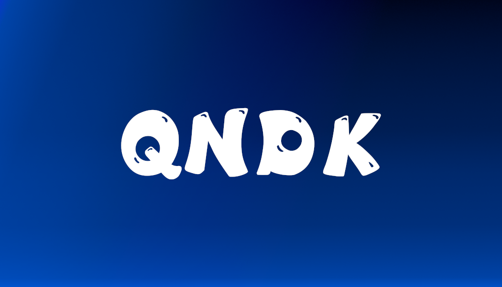

# QNDK

  

  
  
  

## О нас

QNDK - это сообщество единомышленников, объединенных общими интересами и стремлением к развитию. Мы создаем приятную и продуктивную атмосферу для общения, обмена идеями и совместного творчества.

В нашем Discord сервере вы найдете дружелюбных участников, интересные обсуждения и разнообразные активности для всех.

## Наши ценности

- **Уважение** - мы уважаем мнение каждого участника сообщества
- **Творчество** - мы поощряем креативность и новые идеи
- **Поддержка** - мы помогаем друг другу и создаем дружелюбную атмосферу
- **Развитие** - мы стремимся к постоянному личностному и коллективному росту

## Наши проекты

### НейроКубы
Нейрострим с кубами: Курьер, Папич и Амогус. Интерактивные трансляции с нейросетевыми персонажами, которые общаются с чатом в реальном времени и создают уникальный развлекательный контент.

### QndkMine
Minecraft сервер с увлекательными минииграми от QNDK. Уникальные режимы, еженедельные турниры и специальные события. Присоединяйтесь к веселью и станьте частью нашего игрового сообщества!

### PWAI
Нейрострим с НейроПугодом (АРХИВИРОВАНО). История первого нейросетевого стримера. Революционный проект, который положил начало нашим экспериментам с ИИ в сфере развлечений.

### Смешчат
ИИ чат со Смешариками в Discord. Общайтесь с любимыми персонажами из мультсериала, созданными с помощью искусственного интеллекта. Уникальный опыт взаимодействия с персонажами в привычной среде Discord.

## Почему стоит присоединиться

✓ Дружелюбное сообщество единомышленников

✓ Интересные обсуждения на разнообразные темы

✓ Совместные активности и мероприятия

✓ Помощь и поддержка от участников и администрации

✓ Возможность самореализации и развития своих навыков

## Присоединяйтесь к нам

Присоединяйтесь к нашему Discord серверу и станьте частью сообщества QNDK!

[Присоединиться к Discord](https://discord.com/invite/QJZrPhNQPP) 