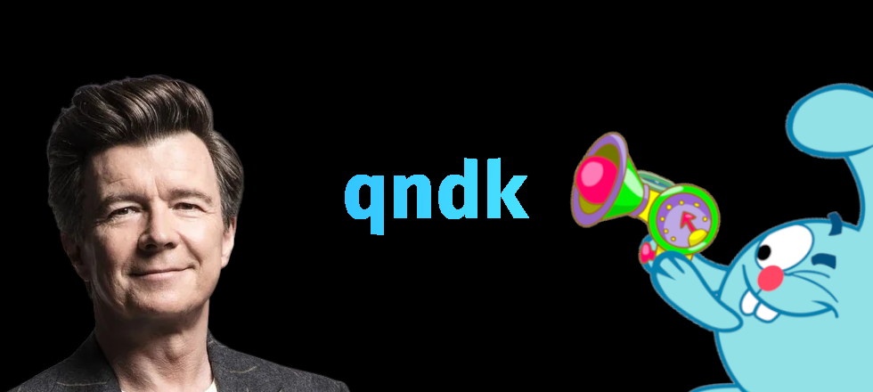

# 
qndk

  

  
  
  

## 
Это мы....! И получается вы нашли наш профиль на GitHub

**Что вы здесь можете найти:**
- OpenSource Projects:
  Это открытые наши проекты, но чаще всего это вспомагательные куски из других проектов, что-нибудь жирное ожидать не стоит.
- Архивные проекты:
  Они уже давно не используятся, и могут хранится у нас на GitHub с пометкой "Public Archive" и с The Unlicense

## 
Чего вы еще ждете?

